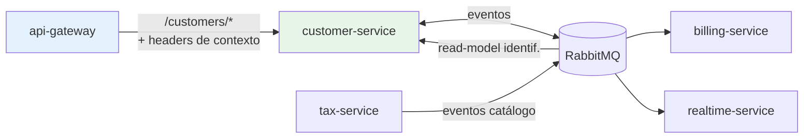
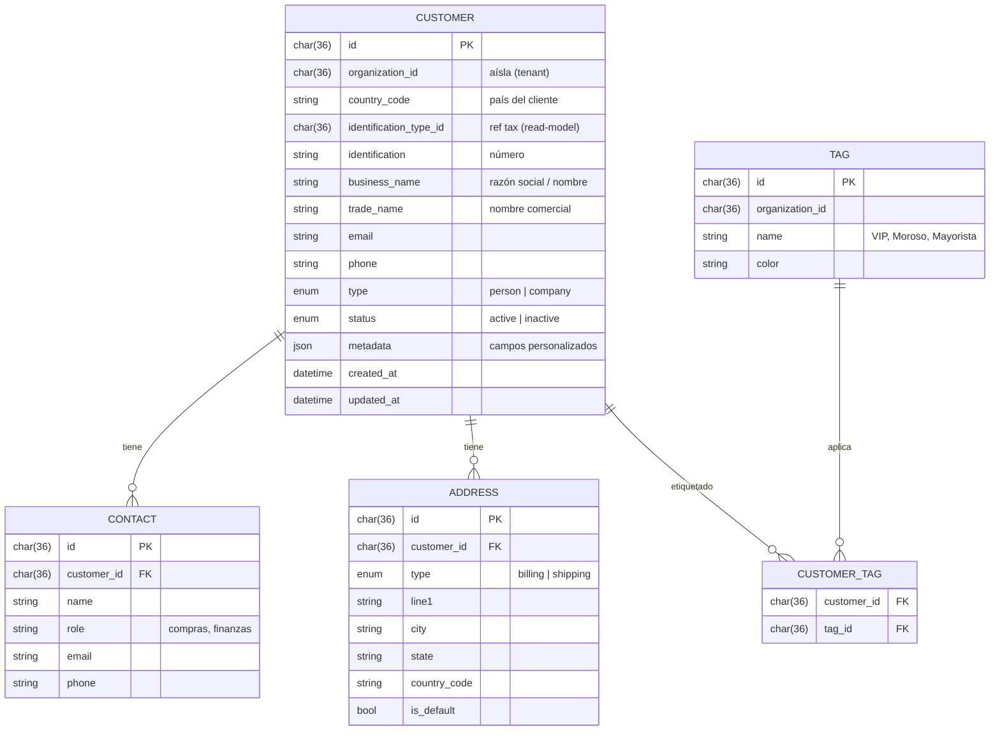
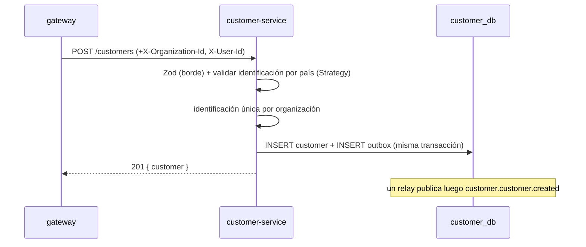
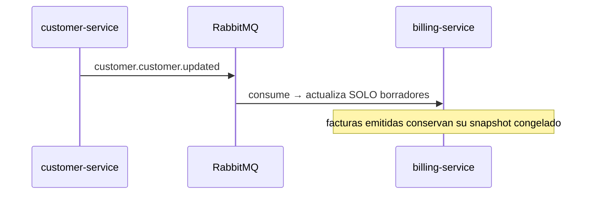

# customer-service

Dueño de los **clientes** del CRM: datos del cliente, **contactos**, **direcciones** y **etiquetas/segmentos**. Es el núcleo del "CRM puro". Vive **detrás del `api-gateway`**: no autentica ni verifica JWT, **confía en los headers de contexto** que el gateway inyecta.

> **Alcance de este repo:** solo el **backend** del servicio. Este primer corte es **README + diseño** (sin código de implementación todavía). Base de datos propia: `customer_db`. Diseño alineado con el vault de arquitectura (`servicios/customer-service.md`, `modelo-datos/relaciones-globales.md`).

---

## Responsabilidad

Poseer y gestionar, **por organización**, el ciclo de vida de:

- **Clientes** (persona o empresa), con su identificación fiscal por país.
- **Contactos** de cada cliente (compras, finanzas, …).
- **Direcciones** (facturación / envío).
- **Etiquetas** (VIP, mayorista, moroso) como base de segmentación.

Y publicar los **eventos** que otros servicios (billing, realtime) necesitan.

### Lo que NO hace

- **No autentica** ni verifica tokens: eso lo hace el gateway. Aquí se confía en los headers de contexto.
- **No emite facturas** ni calcula impuestos: eso es de [billing](../../..) / tax. Aquí solo se **posee** el dato del cliente y su estado.
- **No define** los tipos de identificación ni las tasas: eso es de **tax-service**; aquí se consume vía read-model.
- **No hace JOINs** contra otras bases: las referencias a otros servicios son por **ID** + eventos.

---

## Stack tecnológico

| Capa | Tecnología | Notas |
|------|------------|-------|
| Runtime | Node.js ≥ 20 | LTS |
| Lenguaje | TypeScript | `strict: true` |
| HTTP | Hono.js | detrás del gateway |
| Arquitectura | Clean Architecture | domain / application / infrastructure / interface |
| Persistencia | Sequelize + MySQL | base propia `customer_db` |
| Mensajería | RabbitMQ | patrón **Outbox** (publica) + consumidores |
| Validación | Zod (borde) + reglas de dominio | identificación por país (Strategy) |

Sin `jose`, `argon2` ni librerías de Google: **customer-service no autentica**.

---

## Dónde encaja



El gateway valida el JWT, inyecta contexto y reenvía. customer-service **confía** en ese contexto porque solo es alcanzable a través del gateway (red interna).

### Contexto: headers que inyecta el gateway y este servicio confía

| Header | Significado | Uso en el servicio |
|--------|-------------|--------------------|
| `X-Organization-Id` | organización (tenant) del contexto | **aísla todos los datos**; obligatorio |
| `X-User-Id` | usuario autenticado | auditoría (`created_by`, eventos) |
| `X-Country-Code` | país del contexto (opcional) | default de país / reglas fiscales |
| `X-Request-Id` | id de correlación | logs y trazas; se propaga a los eventos |
| `X-Permissions` | permisos del usuario (del JWT) | verificación fina por endpoint (`customer:*`) |

> Un middleware de contexto lee estos headers y los expone a los casos de uso. Si falta `X-Organization-Id` o `X-User-Id` (petición que no pasó por el gateway) → `401`.
>
> **Permisos** (`customer:read`, `customer:create`, …): se declaran por endpoint y se validan leyendo el header `X-Permissions` que inyecta el gateway (verificación fina). Hoy el JWT aún lleva solo `user_id`/`email`; la verificación se **activa cuando auth-service** incluya los permisos en el token y el gateway los reenvíe como `X-Permissions`. Mientras tanto, se exige contexto autenticado + `organization_id`.

---

## Arquitectura y estructura de carpetas

Clean Architecture, igual que auth-service: el dominio no conoce Hono ni Sequelize.

```
customer-service/
├── src/
│   ├── domain/
│   │   ├── entities/          customer · contact · address · tag
│   │   ├── value-objects/     identification · email · phone
│   │   ├── errors/
│   │   └── repositories/      interfaces (puertos de persistencia)
│   ├── application/
│   │   ├── ports/             unit-of-work · event-publisher (outbox) · identification-validator · tax-read-model
│   │   ├── dtos/
│   │   └── use-cases/         create/list/get/update/disable customer · add contact/address · tags
│   ├── infrastructure/
│   │   ├── config/            carga y valida env (Zod)
│   │   ├── persistence/       sequelize · models · repositories · unit-of-work
│   │   ├── messaging/         publicador outbox · consumidores (billing.invoice.issued, tax.*)
│   │   ├── read-models/       catálogo de identificación (alimentado por eventos de tax)
│   │   └── identification/    estrategias por país: ec_ruc · mx_rfc · co_nit (Strategy)
│   ├── interface/
│   │   └── http/              context-middleware · validators (Zod) · controllers · routes
│   └── main.ts                composition root + arranque
├── migrations/
├── package.json / tsconfig.json / .sequelizerc / sequelize.config.cjs
└── .env.example / .gitignore
```

### La costura multipaís: validación de identificación (Strategy)

El número de identificación se valida según el país, con un **puerto** y una estrategia por país (mismo enfoque "construye la costura ahora, implementa Ecuador primero"):

```ts
// puerto (application)
interface IdentificationValidator {
  validate(countryCode: string, typeCode: string, value: string): boolean;
}
// estrategias (infrastructure/identification): ec_ruc, ec_cedula, mx_rfc, co_nit…
```

Hoy se implementa **Ecuador** (cédula/RUC con dígito verificador); MX/CO quedan como estrategias a enchufar sin tocar el dominio.

---

## Requisitos

- Node.js ≥ 20 y npm
- MySQL con la base `customer_db`
- RabbitMQ accesible (para publicar eventos y alimentar el read-model)

No necesita claves JWT (no verifica tokens).

---

## Variables de entorno

Copia `.env.example` a `.env`.

| Variable | Ejemplo | Descripción |
|----------|---------|-------------|
| `NODE_ENV` | `development` | entorno |
| `PORT` | `3004` | puerto HTTP (interno, detrás del gateway) |
| `DB_HOST` | `localhost` | host MySQL |
| `DB_PORT` | `3306` | puerto MySQL |
| `DB_USER` | `customer_user` | usuario |
| `DB_PASSWORD` | `secret` | contraseña |
| `DB_NAME` | `customer_db` | base de datos propia |
| `RABBITMQ_URL` | `amqp://localhost` | conexión a RabbitMQ |

> El gateway enruta `/customers/*` a este servicio; recuerda registrar `CUSTOMER_SERVICE_URL=http://localhost:3004` en la config del `api-gateway`.

---

## Modelo de datos (`customer_db`)



Tablas de soporte (no de dominio):

- **`identification_types`** — read-model del catálogo de tax-service (`id`, `country_code`, `code` [CEDULA/RUC/RFC/NIT], `name`, `strategy`). Se llena con eventos `tax.*`; permite validar sin llamar a tax en cada request.
- **`outbox_messages`** — patrón Outbox (`id`, `aggregate_type`, `aggregate_id`, `type`, `payload` JSON, `occurred_at`, `processed_at`).

### Aislamiento y país

Dos ejes, ortogonales (ver `modelo-datos/relaciones-globales.md`):

- `organization_id` **aísla**: cada query filtra por la organización del contexto; los datos de una organización nunca se mezclan con otra.
- `country_code` **parametriza**: qué tipo de identificación aplica y cómo se valida. Un cliente puede tener país distinto al de la organización (una empresa EC con un cliente CO); la **factura**, en cambio, usa el país del establecimiento emisor (eso es de billing).

`identification_type_id` referencia el catálogo de **tax-service** (por ID); el código legible (RUC, cédula…) se resuelve desde el read-model local.

---

## API REST

Base montada por el gateway en `/customers`. Todas las rutas **filtran por `organization_id`** del contexto.

| Método | Ruta | Permiso | Descripción |
|--------|------|---------|-------------|
| GET | `/customers?search=&tag=&status=` | `customer:read` | listar (búsqueda, filtro por etiqueta/estado) |
| GET | `/customers/:id` | `customer:read` | detalle (con contactos y direcciones) |
| POST | `/customers` | `customer:create` | crear cliente |
| PATCH | `/customers/:id` | `customer:update` | editar |
| DELETE | `/customers/:id` | `customer:delete` | **baja lógica** (`status = inactive` + evento) |
| POST | `/customers/:id/contacts` | `customer:update` | agregar contacto |
| POST | `/customers/:id/addresses` | `customer:update` | agregar dirección |
| POST | `/customers/:id/tags` | `customer:update` | asignar etiqueta |
| GET | `/tags` | `customer:read` | listar etiquetas |
| POST | `/tags` | `customer:update` | crear etiqueta |

### Contrato de errores

Consistente con auth-service y el gateway: `{ code, message, details? }`. Ejemplos: `VALIDATION_ERROR` (422), `CUSTOMER_NOT_FOUND` (404), `IDENTIFICATION_ALREADY_EXISTS` (409), `INVALID_IDENTIFICATION` (422), `UNAUTHORIZED` (401).

---

## Flujos

**Crear cliente** (atómico con Outbox):



**Actualización que afecta a facturación:**



---

## Eventos

**Publica** (nombres en pasado, `contexto.evento`):

| Evento | Cuándo | Consumido por |
|--------|--------|---------------|
| `customer.customer.created` | nuevo cliente | realtime (listas en vivo) |
| `customer.customer.updated` | edición | billing (actualiza borradores) |
| `customer.customer.disabled` | baja lógica | billing (impide nuevas facturas) |

**Consume:**

| Evento | Origen | Acción |
|--------|--------|--------|
| `billing.invoice.issued` | billing | (opcional) actualizar "última compra" / estadísticas |
| `tax.identification_type.*` | tax | mantener el read-model `identification_types` |

---

## Validaciones

- **Borde (Zod):** email y teléfono válidos, `type ∈ {person, company}`, campos requeridos según el tipo.
- **Dominio:**
  - `identification` válida según la **estrategia del país** (dígito verificador RUC/cédula/RFC/NIT).
  - `identification` **única por organización** (no duplicar el mismo cliente).
  - No se factura a un cliente `inactive` (el estado se **posee aquí**; billing lo respeta).

---

## Seguridad

- **No verifica JWT**: confía en los headers del gateway; exige `X-Organization-Id` + `X-User-Id`.
- **Aislamiento estricto** por `organization_id` en toda lectura y escritura.
- **Permisos** por endpoint (`customer:*`) leídos de `X-Permissions` (los inyecta el gateway desde el JWT de auth-service).
- Solo alcanzable por la red interna (detrás del gateway); no expuesto directo.

---

## Convenciones

- Base de datos **propia**; nada de JOINs a otras bases. Referencias por **ID** + eventos + read-models.
- Toda tabla de negocio lleva `organization_id`; lo fiscal se filtra por `country_code`.
- Cambios de estado + eventos, **atómicos** vía Outbox.
- Eventos en pasado (`customer.customer.created`).
- Errores con cuerpo estándar `{ code, message, details }`.
- Estrategias por país enchufables sin tocar el dominio (hoy: Ecuador).
